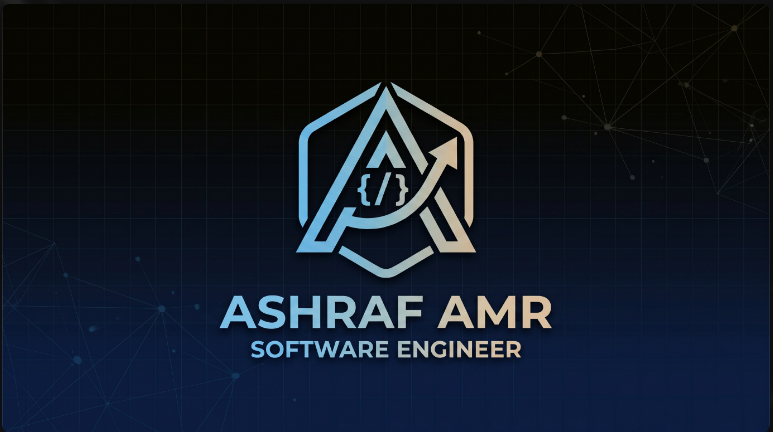

  

<h1 align="center">👋 Hi, I'm Ashraf Amr</h1>
<h3 align="center">💻 Python Developer | 15 y/o | Egypt</h3>

  

---

## 🚀 About Me

- 🔥 I build age-calculator-pro-max-ultra - counts your life in 465 billion microseconds 
- 🧠 Currently mastering: Python, OOP, Data Structures & Building my brand
- 🎯 Goal 2026: Become the youngest Software Engineer in MENA 
- 💻 I code on: VS Code, GitHub, Google Colab
- ⚡ Fun fact: I question my existence in microseconds datetime.utcnow() 😂
- 📫 Ask me about: Python, GitHub, Microsecond Precision

> "Building my future one line at a time" 💪

### 🛠️ Languages and Tools

  
  

<h2 align="center">📊 GitHub Stats</h2>

  

  

  

### 📫 Connect with me

  [ashraf.amr72011@gmail.com](mailto:ashraf.amr72011@gmail.com)

